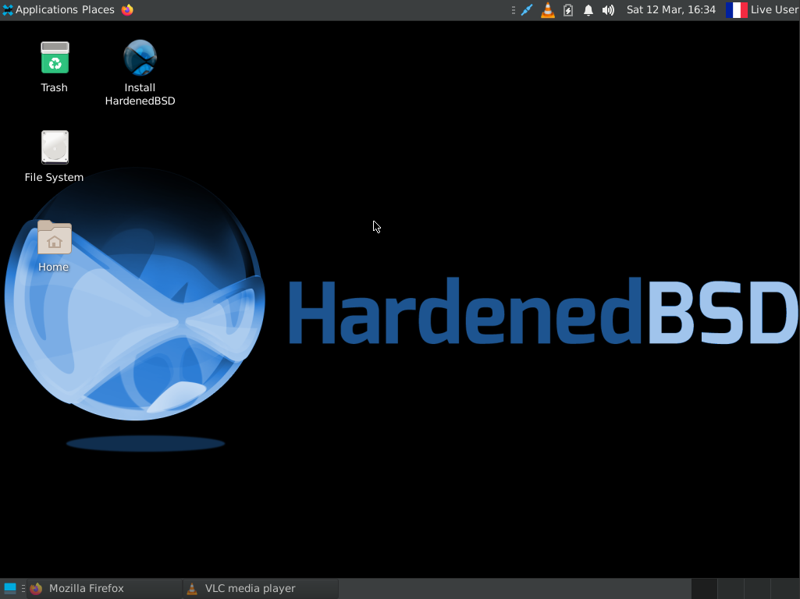

LiveCD builder for HardenedBSD



## System Requirements for building LiveCD

* 2 GHz dual core processor
* 4 GiB RAM (system memory)
* 50 GB of hard-drive space
* Either a CD-RW/DVD-RW drive or a USB port for writing the installer media
* HardenedBSD 12-STABLE or later

## System Requirements for using LiveCD

* 2 GHz dual core processor
* 4 GiB RAM (system memory for physical and viritualized installs)
* VGA capable of 1024x768 screen resolution 
* Either a CD/DVD drive or a USB port for booting the installer media

## Customize (optional)

Add more packages to XFCE edition:
```
edit settings/packages.xfce
```

Enable more services:
```
edit settings/rc.conf.xfce
```

## Build a new release 
Generate an ISO with XFCE:
```
./build.sh
```
Generate an ISO with Mate:
```
./build.sh mate
```
Generate an ISO with Gnome3:
```
./build.sh gnome
```
Generate an ISO with KDE Plasma 5:
```
./build.sh kde
```

## Burn

Burn the XFCE image to DVD:

```
pkg install cdrtools
cdrecord /usr/local/furybsd/iso/HardenedBSD-13-stable-XFCE-amd64.iso
```

Write the XFCE image to USB stick:
```
sudo dd if=/usr/local/furybsd/iso/HardenedBSD-13-stable-XFCE-amd64.iso of=/dev/daX bs=4m status=progress
```

## Credentials for live media

There is no password for `liveuser`. The `liveuser` account is removed upon install.  There is also no root password until it is set in the installer.

## Special Thanks

Thanks of all developers of FuryBSD, end-of-life project to whom we owe the foundations of this Live-CD.
